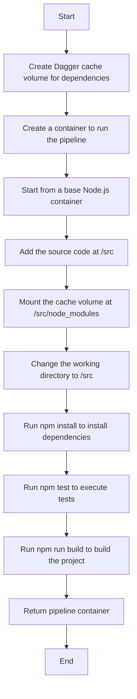

# Build Node.js Application

This section describes the steps to build a Node.js application using Dagger.



To run the pipeline locally, execute the following command from the `1_building_nodejs`
folder:

```sh
dagger call run-pipeline --source="project"
```
