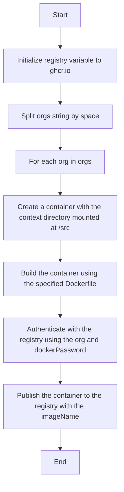

# Build and publish dockerfile to GHCR

This section describes the steps to build and publish a Docker image to the
GitHub Container Registry.



To build and push the Docker image locally, execute the following command from
the `2_build_publish_dockerfile_to_GHCR/dockerdemo` folder:

```sh
dagger call build-and-push-image --dockerfile-path="devops.dockerfile" --context-dir="../dockerfiles" --docker-password=env:DOCKER_PASSWORD --orgs="staytunedllp"
```
