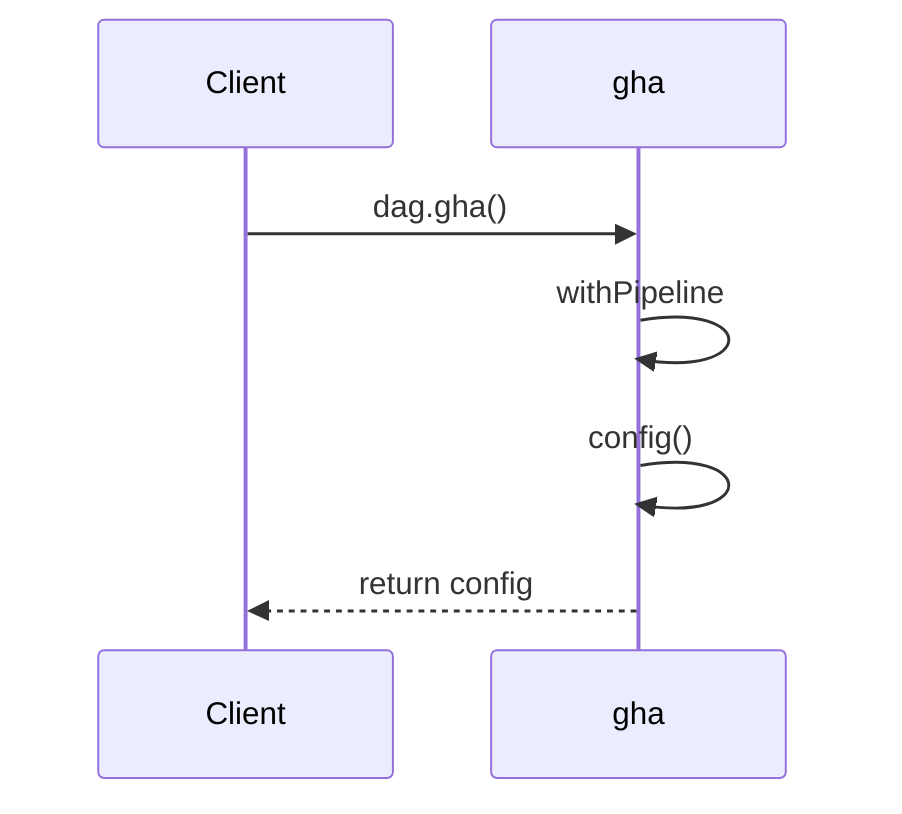

# 

This section describes the steps to create github action pipeline using dagger
module
[GHA](https://daggerverse.dev/mod/github.com/shykes/gha@a8671414892009ecdcadc84c8fed9d22984209bc)



To create Github config using GHA locally, execute the following command from
`ghademo` folder,

```sh
dagger call gha-on-push -o ~/Github/beingminimal/StaytunedLLP/meetup/`
```
